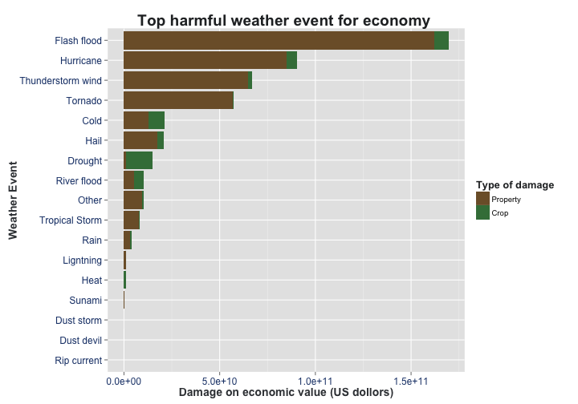

# Analysis on storm aganistpopulation healh


## 1- Synopsis
  - This paper presents an analysis about the effect of storm on the population health.[Why we study this topic]. We analysis the data published by the )National Weather Service Instruction in 2007. These data . We use [data process technic]. We found[research findins] . [Implication and advice]


## 2 - Analysis Question
 1. Across the United States, which types of events (as indicated in the EVTYPE variable) are most harmful with respect to popuulation health
 2.  Across the United States, which types of events have the greatest economic consequences
 
## 3- Data Processing

- 1. Load data

```r
library(ggplot2)
```


```r
# attributes dUrl <-
# 'https://d396qusza40orc.cloudfront.net/repdata%2Fdata%2FStormData.csv.bz2'
# download.file(dUrl, f, mode = 'wb')
ff <- file.path(getwd(), "repdata-data-StormData.csv.bz2")
data <- read.csv(ff, stringsAsFactors = FALSE)
```


- 2. Variables we keep for analysis
  Variabl Name | Description|
  -------------|-------------|
   state      | Abbervation for states in US |
   evtype     | Event type |
   fatalites  | The number of people died|
   injures   | The number of people injuured|
   propdmg    | The amount of property damge (measured in money)|
   propdmgexp  | The unit of  damge (B,M,K,H)|
   corpdmg  | The amount of corp damge (measured in money)|
   corpdmgexp    | The unit of  damge (B,M,K,H)|


```r
# attributes

attributes <- c("STATE", "EVTYPE", "FATALITIES", "INJURIES", "PROPDMG", "PROPDMGEXP", 
    "CROPDMG", "CROPDMGEXP")

pData <- data[, attributes]
colnames(pData) <- c("state", "evtype", "fatalites", "injures", "propdmg", "propdmgexp", 
    "corpdmg", "corpdmgexp")
names(pData)
```

```
## [1] "state"      "evtype"     "fatalites"  "injures"    "propdmg"   
## [6] "propdmgexp" "corpdmg"    "corpdmgexp"
```

### 3.1 Data cleanning
   
#### 3.1.1  Event tpye 

      - Group all events with five main category
      - Create a column as the unified name of that eventype 
      - The hierachy looks like as follow:
        - Convection
          - lightning
          - tornado
          - thunderstorm Wind
          - hail
        - ExtremeTemp
          - cold
          - heat
        - Marine
          - costal Storm
          - sunami
          - runami
          - rip Current
        - Flood
          - flash Flood
          - river Flood
        - Tropical Cyclones
          - tropical Storm
          - hurricane
        - Other
          - drought
          - dust Storm
          - dust Devil
          - rain
      - The unified event name and filtr expression:
      
  Event    |    Filter expression  |  
------------------| ----------------|
  Lightning |  LIGHTNING | 
  Tornado   | NADO,FUNNEL,WATERSPOUT"|
  Thunderstorm wind |  THUNDER,STORM,WIND | 
  Hail |  HAIL | 
  Cold |  BLIZZARD|WINTER|COLD|LOW TEMP|RECORD LOW|SNOW|ICE | 
  Heat |  HEAT|WARM|RECORD HIGH | 
  Costa l Storm |  COSTAL STORM | 
  Sunami | SUNAMI | 
  Rip current|RIP CURRENT
  Flash flood   |  FLASH FLOOD,FLD,FLOOD | 
  River flood   |  RIVER FLOOD , URBAN FLOOD | 
  Tropical Storm |TROPICAL STORM,TROPICAL|
  Hurricane   | HURRICANE |
   Drought   | DROUGHT |
    Dust storm   | DUST STORM |
        Dust devil   | DUST DEVIL |
    RAIN  | rain |


```r
deliverEvtUnifiedName <- function(dd) {
    evtMatcher <- data.frame(reg = c("NADO|FUNNEL|WATERSPOUT", "THUNDER|STORM|WIND", 
        "HAIL", "FROST|FREEZ|BLIZZARD|WINTER|COLD|LOW TEMP|RECORD LOW|SNOW|ICE", 
        "HEAT|WARM|RECORD HIGH", "COSTAL STORM", "SUNAMI", "RIP CURRENT", "FLASH FLOOD|FLD|FLOOD", 
        "RIVER FLOOD|URBAN FLOOD", "TROPICAL STORM|TROPICAL", " ", "DROUGHT", 
        "DUST STORM", "DUST DEVIL", "RAIN", "LIGHTNING"))
    
    factorId <- c("Tornado", "Thunderstorm wind", "Hail", "Cold", "Heat", "Costal Storm", 
        "Sunami", "Rip current", "Flash flood", "River flood", "Tropical Storm", 
        "Hurricane", "Drought", "Dust storm", "Dust devil", "Rain", "Ligntning", 
        "Other")
    
    for (i in 1:nrow(evtMatcher)) {
        indexFit <- grep(evtMatcher[i, "reg"], toupper(dd[, "evtype"]))
        if (length(indexFit) > 0) {
            dd[indexFit, "event"] <- factorId[i]
            
        }
    }
    return(dd)
}
```


  - Use the function to filter and put value into "event"

```r


pData$event <- ("-")

# Give each event an unified id factor (17+1 factors)
pData <- deliverEvtUnifiedName(pData)
otherIndex <- grep("-", pData[, "event"])
pData[otherIndex, "event"] <- "Other"
pData$event <- as.factor(pData$event)

# See the event and number of that table(sort(-pData$event))
```


#### 3.1.2  Create an exact amounts for property and corp damage
        - Fomula I  : propdmgValue = propdmg       *  propdmgexp
        - Fomula II : cropdmgValue = cropdmg       *  cropdmgexp  

        
              propdmgexp   |  unit   
           ----------------| ----------------
              B            |  1,000,000,000
              M            |      1,000,000   
              K            |          1,000 
              H            |            100
              NA or BLANK  |              1


```r
deliverActualDmgValue <- function(dd) {
    unit <- data.frame(cha = c("B", "M", "K", "H"), val = c(1e+09, 1e+06, 1000, 
        100))
    dd$cropdmgvalue <- dd$corpdmg
    dd$propdmgvalue <- dd$propdmg
    for (i in 1:nrow(unit)) {
        indexCrodFit <- grep(as.character(unit[i, "cha"]), toupper(dd[, "corpdmgexp"]))
        if (length(indexCrodFit) > 0) {
            dd[indexCrodFit, "corpdmgvalue"] <- unit[i, "val"] * dd[indexCrodFit, 
                "corpdmg"]
        }
        indexProdFit <- grep(as.character(unit[i, "cha"]), toupper(dd[, "propdmgexp"]))
        if (length(indexProdFit) > 0) {
            dd[indexProdFit, "propdmgvalue"] <- unit[i, "val"] * dd[indexProdFit, 
                "propdmg"]
        }
    }
    return(dd)
}

pData <- deliverActualDmgValue(pData)

# see the value:
summary(pData$corpdmgvalue)
```

```
##     Min.  1st Qu.   Median     Mean  3rd Qu.     Max.     NA's 
## 0.00e+00 0.00e+00 0.00e+00 1.73e+05 0.00e+00 5.00e+09   618440
```

```r
summary(pData$prodmgvalue)
```

```
## Length  Class   Mode 
##      0   NULL   NULL
```

```r


# Add a new variable: propdmagevalue + corpdmgvalue
pData$ecodmgvalue <- pData$corpdmgvalue + pData$propdmgvalue
pData$pephealthdmg <- pData$injures + pData$fatalites
summary(pData$ecodmgvalue)
```

```
##     Min.  1st Qu.   Median     Mean  3rd Qu.     Max.     NA's 
## 0.00e+00 0.00e+00 0.00e+00 9.86e+05 5.00e+03 1.15e+11   618440
```

          
#### 3.2 Data Aggeratiion

```r

library(reshape2)
t0 <- aggregate(cbind(ecodmgvalue, pephealthdmg) ~ event, pData, FUN = sum)
t <- aggregate(cbind(propdmgvalue, corpdmgvalue, injures, fatalites) ~ event, 
    pData, FUN = sum)

tidy <- melt(t, id.var = "event", variable.name = "variable")
colnames(tidy) <- c("event", "damagetype", "value")
print(t0)
```

```
##                event ecodmgvalue pephealthdmg
## 1               Cold   1.835e+09          431
## 2            Drought   1.421e+10           23
## 3         Dust devil   3.811e+05           26
## 4         Dust storm   7.049e+06           74
## 5        Flash flood   1.386e+11         6760
## 6               Hail   1.102e+10          306
## 7               Heat   4.031e+08         1773
## 8          Hurricane   4.972e+10         8383
## 9          Ligntning   3.274e+08         1187
## 10             Other   4.579e+10         1795
## 11              Rain   1.267e+09           63
## 12            Sunami   1.441e+08          162
## 13 Thunderstorm wind   1.816e+06            0
## 14           Tornado   1.659e+10        13024
```

```r
print(tidy)
```

```
##                event   damagetype     value
## 1               Cold propdmgvalue 1.057e+08
## 2            Drought propdmgvalue 2.339e+08
## 3         Dust devil propdmgvalue 3.811e+05
## 4         Dust storm propdmgvalue 3.449e+06
## 5        Flash flood propdmgvalue 1.329e+11
## 6               Hail propdmgvalue 7.992e+09
## 7               Heat propdmgvalue 1.655e+06
## 8          Hurricane propdmgvalue 3.244e+10
## 9          Ligntning propdmgvalue 3.153e+08
## 10             Other propdmgvalue 4.012e+10
## 11              Rain propdmgvalue 3.474e+08
## 12            Sunami propdmgvalue 1.441e+08
## 13 Thunderstorm wind propdmgvalue 5.500e+03
## 14           Tornado propdmgvalue 1.617e+10
## 15              Cold corpdmgvalue 1.729e+09
## 16           Drought corpdmgvalue 1.397e+10
## 17        Dust devil corpdmgvalue 0.000e+00
## 18        Dust storm corpdmgvalue 3.600e+06
## 19       Flash flood corpdmgvalue 5.671e+09
## 20              Hail corpdmgvalue 3.026e+09
## 21              Heat corpdmgvalue 4.015e+08
## 22         Hurricane corpdmgvalue 1.728e+10
## 23         Ligntning corpdmgvalue 1.210e+07
## 24             Other corpdmgvalue 5.668e+09
## 25              Rain corpdmgvalue 9.193e+08
## 26            Sunami corpdmgvalue 2.000e+04
## 27 Thunderstorm wind corpdmgvalue 1.810e+06
## 28           Tornado corpdmgvalue 4.150e+08
## 29              Cold      injures 4.070e+02
## 30           Drought      injures 1.900e+01
## 31        Dust devil      injures 2.500e+01
## 32        Dust storm      injures 6.900e+01
## 33       Flash flood      injures 6.495e+03
## 34              Hail      injures 3.040e+02
## 35              Heat      injures 1.554e+03
## 36         Hurricane      injures 6.899e+03
## 37         Ligntning      injures 1.014e+03
## 38             Other      injures 1.578e+03
## 39              Rain      injures 4.700e+01
## 40            Sunami      injures 1.290e+02
## 41 Thunderstorm wind      injures 0.000e+00
## 42           Tornado      injures 1.196e+04
## 43              Cold    fatalites 2.400e+01
## 44           Drought    fatalites 4.000e+00
## 45        Dust devil    fatalites 1.000e+00
## 46        Dust storm    fatalites 5.000e+00
## 47       Flash flood    fatalites 2.650e+02
## 48              Hail    fatalites 2.000e+00
## 49              Heat    fatalites 2.190e+02
## 50         Hurricane    fatalites 1.484e+03
## 51         Ligntning    fatalites 1.730e+02
## 52             Other    fatalites 2.170e+02
## 53              Rain    fatalites 1.600e+01
## 54            Sunami    fatalites 3.300e+01
## 55 Thunderstorm wind    fatalites 0.000e+00
## 56           Tornado    fatalites 1.064e+03
```


### 4- Results
#### 4.1  The most harmful for people health
  - Extract rows that contains info about people impact on populaiton health 

```r
library("ggplot2")
damgeOnHealth <- tidy[grep("fatalites|injures", tidy[, "damagetype"]), ]

ggplot(damgeOnHealth, aes(x = reorder(event, value), y = value, fill = factor(damagetype, 
    labels = c("Injures", "Fatalites")))) + geom_bar(stat = "identity") + labs(title = "Top harmful weather event for populaiton health", 
    x = "Event", y = "Damage on populaiton health (number of people)") + scale_fill_manual(values = c("#F7B388", 
    "#C70000")) + guides(fill = guide_legend(title = "Type of damage")) + xlab("Weather Event") + 
    theme(axis.text = element_text(size = 12, colour = "#1F4178"), axis.title = element_text(size = 14, 
        colour = "#3A3E42", face = "bold"), title = element_text(size = 16, 
        colour = "#282B2E", face = "bold")) + coord_flip()
```

 


  Rank  | Event   |  People Headth Harm injuries+fatalites | 
  ------ | -------- | ------------- |
 1 |           Tornado     |   97078 | 
 2 | Thunderstorm wind    |    12608 | 
 3 |         Heat    |    12400 | 
 4 |       Flash flood   |     10250 | 
 5 |      Cold   |     7415 | 

#### 4.2  The most harmful for economic value 
 Rank| Event   |  People Headth Harm (injuries+fatalites) | 
 - | -------- | ------------- |
 1 |           Tornado     |   97078 | 
 2 | Thunderstorm wind    |    12608 | 
 3 |             Heat    |    12400 | 
 4 |       Flash flood   |     10250| 
 5 |      Cold   |     7415| 


```r

damgeOnEconomic <- tidy[grep("corpdmgvalue|propdmgvalue", tidy[, "damagetype"]), 
    ]
ggplot(damgeOnEconomic, aes(x = reorder(event, value), y = value, fill = factor(damagetype, 
    labels = c("Property", "Crop")))) + geom_bar(stat = "identity") + labs(title = "Top harmful weather event for economic ", 
    x = "Event", y = "Damage on economic value (US dollors)") + scale_fill_manual(values = c("#7D5E35", 
    "#407D47")) + guides(fill = guide_legend(title = "Type of damage")) + xlab("Weather Event") + 
    theme(axis.text = element_text(size = 12, colour = "#1F4178"), axis.title = element_text(size = 14, 
        colour = "#3A3E42", face = "bold"), title = element_text(size = 16, 
        colour = "#282B2E", face = "bold")) + coord_flip()
```

 


